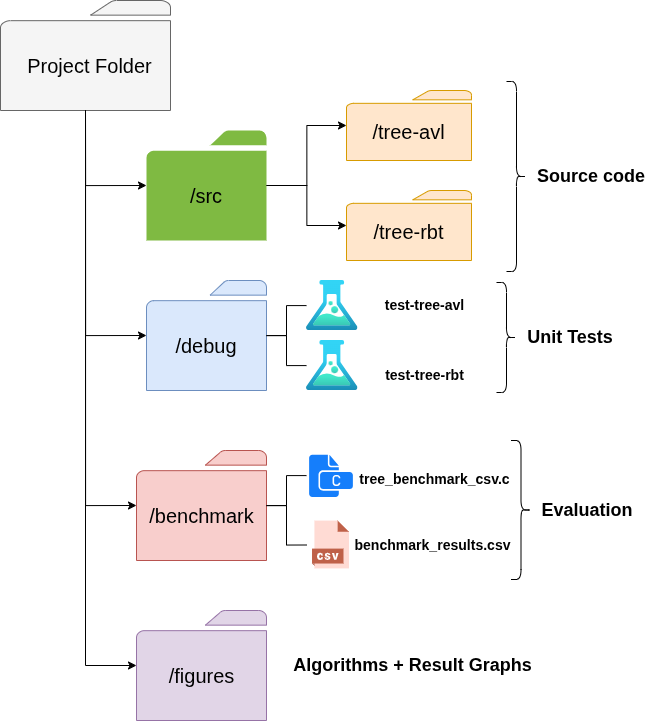
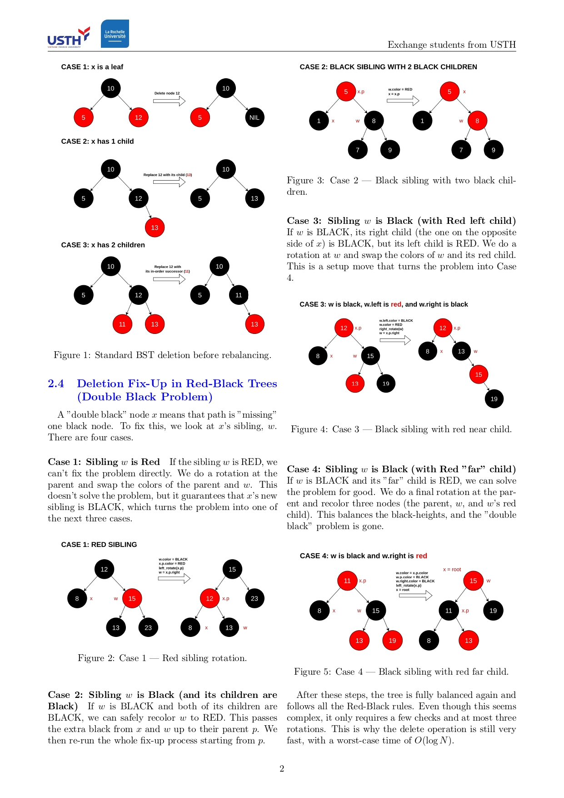

# AVL vs. Red-Black Tree Performance Analysis
This group project implements and compares two generic, self-balancing binary search trees: the AVL Tree and the Red-Black Tree.

## 1. Project Structure
<center>

</center>
The repository includes:

* Generic C implementations for an AVL Tree (`src/tree-avl/`) and a Red-Black Tree (`src/tree-rbt/`).

* Unit tests for both data structures (`test-tree-avl.c` and `test-tree-rbt.c`).

* A comprehensive benchmark program (`benchmark/tree_benchmark_csv.c`) to compare the performance of `insert`, `search`, and `delete` operations for both trees.

## 2. Unit Tests

This section describes how to compile and run the individual unit tests for each tree implementation to verify their correctness.

**Build (with CMake)**

We use cmake and make to build the unit tests. The following commands assume you are at the root of the project.

**Build AVL Unit Test:**

```bash
# 1. Create a debug directory for the AVL test
mkdir -p debug/tree-avl && cd debug/tree-avl

# 2. Run CMake to configure the build
cmake ../../src/tree-avl/ -DCMAKE_INSTALL_PREFIX=../tmp -DCMAKE_BUILD_TYPE=Debug

# 3. Compile the code and return to home
make && cd ../..
```

Build Red-Black Tree Unit Test:

```bash
# 1. Create a debug directory for the RBT test
mkdir -p debug/tree-rbt && cd debug/tree-rbt

# 2. Run CMake to configure the build
cmake ../../src/tree-rbt/ -DCMAKE_INSTALL_PREFIX=../tmp -DCMAKE_BUILD_TYPE=Debug

# 3. Compile the code and return to home
make && cd ../..
```

**Run**

After building, you can run the compiled test binaries from the root directory:
```bash
# Run the AVL test
./debug/tree-avl/test-tree-avl

# Run the RBT test
./debug/tree-rbt/test-tree-rbt
```

**Expected Output**

If the implementations are correct, you will see the test output, including checks for integers, strings, and dictionary structures.
```

===== Test AVL avec int =====
>Insertion (30)
Post-order après insertion :
Valeur : 30 (Color: BLACK)

>Insertion (20)
Post-order après insertion :
Valeur : 20 (Color: RED)
Valeur : 30 (Color: BLACK)

...

===== Test AVL avec chaînes =====
>Insertion (pomme)
Post-order après insertion :
Valeur : pomme      (Color: BLACK)

>Insertion (banane)
Post-order après insertion :
Valeur : banane     (Color: RED)
Valeur : pomme      (Color: BLACK)

...

===== Test AVL avec structures (mot, definition) =====
>Insertion (chien)
Post-order après insertion :
{chien   : animal domestique } (COLOR: BLACK)

...

>Insertion (voiture)
Post-order après insertion :
{arbre   : plante ligneuse   } (COLOR: RED)
{chat    : animal mignon     } (COLOR: BLACK)
{voiture : moyen de transport} (COLOR: RED)
{maison  : lieu d'habitation } (COLOR: BLACK)
{chien   : animal domestique } (COLOR: BLACK)


Tous les tests sont terminés avec succès.

```

## 3. Performance Benchmark

This section describes how to build and run the main benchmark program (`tree_benchmark_csv.c`) that compares the two trees and generates the data for our graphs.

**Build (Manual)**

The benchmark file is self-contained (it includes the .c files directly), so we can compile it with a single gcc command.

```bash
# 1. Navigate to the benchmark directory
cd benchmark/

# 2. Compile the benchmark file.
# -O2 enables optimizations, which is crucial for a real benchmark.
# -lm links the math library.
gcc BENCHMARK_DUONG.c -o benchmark -O2 -lm
```

**Run**

After compiling, run the executable from within the benchmark directory:

```bash
./benchmark
```

**Expected Output**

The program will run the experiment, averaging multiple trials for N from 50 to 1000. It will print the results to the console and save them in a CSV file.

```bash
N, AVL_Insert (ms), RBT_Insert (ms), AVL_Search (ms), RBT_Search (ms), AVL_Delete (ms), RBT_Delete (ms)
50,0.014085,0.009905,0.001265,0.001183,0.0132780,0.009962
100,0.0194636,0.008637,0.000856,0.000856,0.018376,0.008546
...
1000,0.1441810,0.121686,0.008377,0.008575,0.150877,0.110489

Benchmark complete. Results saved to benchmark_results.csv
```


## 4. Performance Results

The `benchmark_results.csv` file can be plotted to visually compare the performance. The following graph shows the total time (in milliseconds) required to perform N operations for each tree.
<center>

</center>

**Analysis**

* Complexity: All operations correctly display O(N log N) total time complexity (seen as the gently curving lines) and are not O(1) (flat) or O(N^2) (steep curve).

* Insertion/Deletion: The Red-Black Tree consistently outperforms the AVL Tree in insertion- and deletion-heavy workloads. This is because its rebalancing rules are less strict, requiring fewer and simpler rotations on average.

* Search: The AVL Tree shows a slight performance advantage in the search-only benchmark. Its stricter balancing rules guarantee a shorter maximum tree height, resulting in fewer comparisons in the worst case.

## 5. Final Report

If you're interested and want to read our final report, check out [here](/FinalReportComparisonAVLRedBlack.pdf)

<center>

</center>